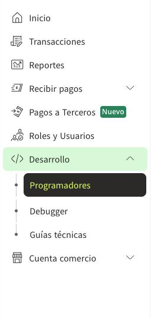
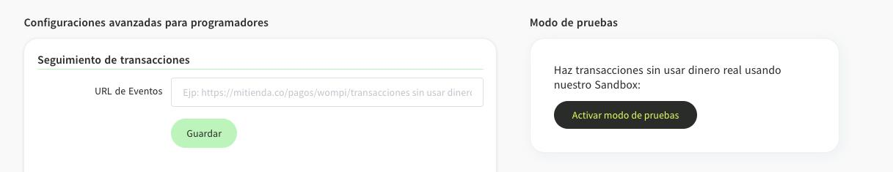
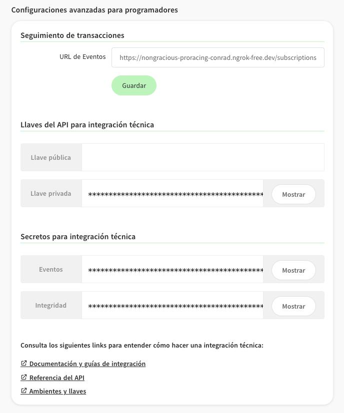
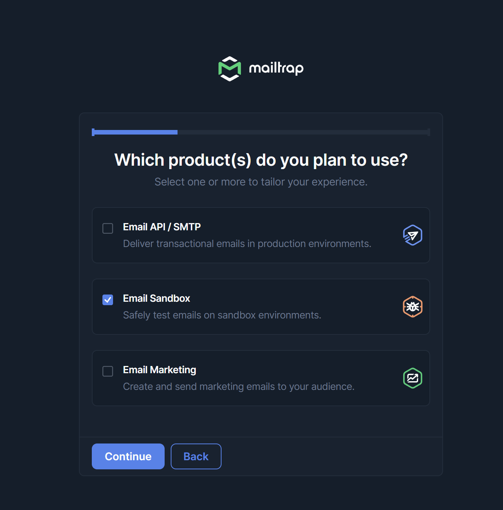
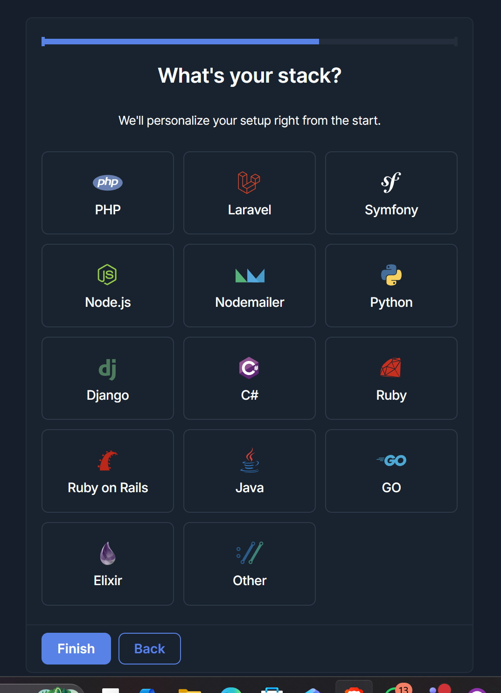
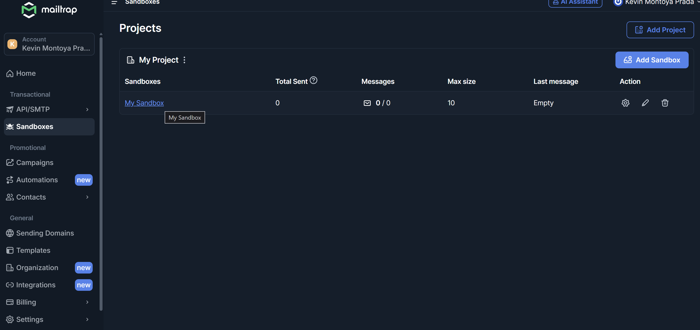
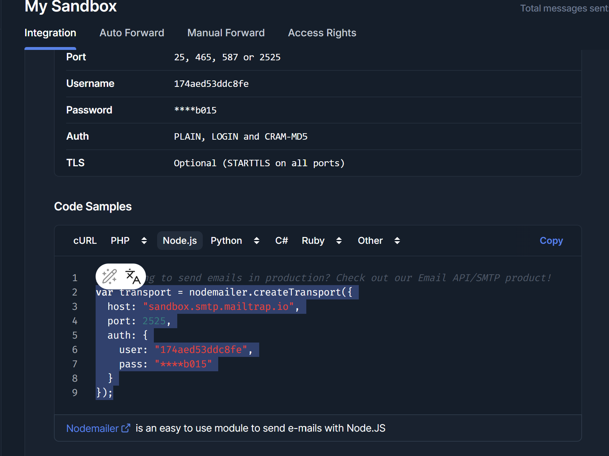

# 🛠️ Guía de Configuración de Entorno - Backend

Este documento detalla los pasos necesarios para configurar las variables de entorno de las plataformas externas y la base de datos local.

## 📋 Pasos Iniciales
1. Crea un archivo llamado `.env` en la raíz de la carpeta `src`.
2. Copia el contenido del bloque final de este documento y pégalo en tu nuevo archivo `.env`.
3. Sigue las instrucciones de cada plataforma a continuación:

---

## 1. 🗄️ Base de Datos (MySQL)
1. Abre tu gestor de base de datos (MySQL Workbench, phpMyAdmin, etc.).
2. Crea una nueva base de datos vacía (ej. `cotionline_db`).
3. En el archivo `.env`, asegúrate de que `DB_USER` y `DB_PASSWORD` coincidan con tus credenciales locales.
4. Mantén `NODE_ENV=development` para que el ORM sincronice las tablas automáticamente al iniciar.

## 2. 💳 Pasarela de Pagos (Wompi)
1. **Registro:** Ve a [Wompi.co](https://wompi.co/) y regístrate en el ambiente de **Sandbox** (Pruebas).
   
 
 
2. **Obtener Llaves:** Entra al "Dashboard" -> sección "Desarrolladores" -> "Configuración avanzada para programadores".

 
 
3. **Configuración:**
   - Copia la **Llave pública** en `WOMPI_PUBLIC_KEY`.
   - Copia la **Llave privada** en `WOMPI_PRIVATE_KEY`.
   - Genera y copia el **Secreto de integridad** en `WOMPI_INTEGRITY_SECRET` (necesario para validar transacciones).
   - Configura el **Secreto de eventos** si vas a usar Webhooks.
  
  

## 3. 📧 Servicio de Correo (Mailtrap)
1. **Registro:** Ve a [Mailtrap.io](https://mailtrap.io/), crea una cuenta gratuita, selecciona el tipo de Mail (email sandbox) y el stack de desarrollo (node.js u otro).
 
   
   
   
2. **Configuración de Inbox:** Ve a "Sandboxes" -> "My sandbox".
 
   
   
3. **Credenciales:** Selecciona SMTP y verás las credenciales `host`, `port`,`username` y `password`.
   
   
   
4. **Copiar Datos:** Copia el `user` y `pass` proporcionados en las variables `SMTP_USER` y `SMTP_PASS` de tu archivo `.env`.
5. **Ejecutar Terminal:** Abrir una segunda terminal en el editor y ejecutar el comando `ngrok http 3000`, esto se hace con el fin de que el servicio de correo este apuntando a la ubicación del puerto de la API; de no hacerse, el servicio de correo no funcionará

## 4. 🔐 Seguridad (JWT)
1. Inventa dos cadenas de texto largas y aleatorias (puedes usar un generador de contraseñas).
2. Pégalas en `JWT_SECRET` y `JWT_RECOVERY_SECRET`. Estas llaves firman los tokens de sesión de los usuarios.

---

## 📄 Plantilla para el archivo .env

```env
# -------------------------------------------------------------
# CONFIGURACIÓN DE ENTORNO - COTIONLINE
# -------------------------------------------------------------

PORT=3000

# [BASE DE DATOS]
DB_TYPE=mysql
DB_HOST=localhost
DB_PORT=3306
DB_USER='tu_usuario'
DB_PASSWORD='tu_contraseña'
DB_NAME='tu_nombre_de_bd'

NODE_ENV=development

# [SECRETOS DE SEGURIDAD]
JWT_SECRET='valor_aleatorio_muy_seguro'
JWT_RECOVERY_SECRET='otro_valor_aleatorio_seguro'

# [PASARELA DE PAGOS - WOMPI]
WOMPI_PUBLIC_KEY='pub_test_...'
WOMPI_PRIVATE_KEY='prv_test_...'
WOMPI_INTEGRITY_SECRET='identificador_de_integridad'
WOMPI_EVENTS_SECRET='secreto_de_eventos'
WOMPI_CURRENCY=COP

# [SERVICIO DE CORREO - MAILTRAP]
SMTP_HOST=sandbox.smtp.mailtrap.io
SMTP_PORT=2525
SMTP_USER='tu_usuario_mailtrap'
SMTP_PASS='tu_password_mailtrap'

# [FRONTEND]
FRONTEND_URL='http://localhost:4200'
